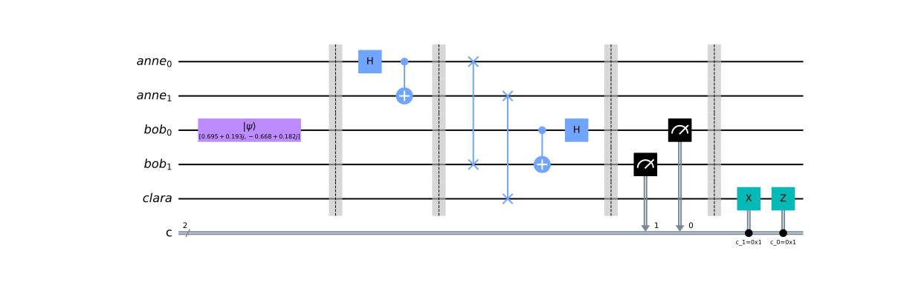
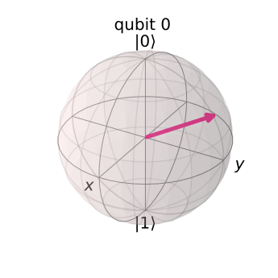

# quantum-teleportation
A quantum circuit for teleportation of information using a pre-distributed entangled qubit pair and two classical bits, written in python using Qiskit and ran on IBM's quantum computers

### circuit

Initial Qubit             |  Final Qubit
:-------------------------:|:-------------------------:
 | 